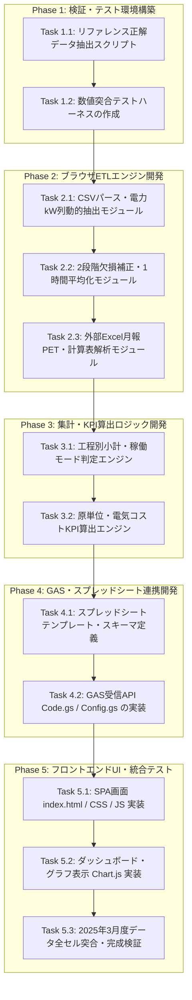

# 実装計画書（構築手順）
## プロジェクト名：エネルギー使用量集計システム

---

## 1. 全体実装方針と開発フロー

本システムは、Claude Code または Gemini がタスク単位で順次コードを生成・テスト・結合できるように、以下の5つのフェーズ（全12タスク）で構築します。



---

## 2. 詳細タスク仕様（WBS）

### 【Phase 1】検証・テスト環境構築

#### Task 1.1: リファレンス正解データの抽出スクリプト作成
- **目的**: 既存Excelの正解数値をJSON/CSVで抽出し、実装モジュールが吐き出す数値と機械的に全セル比較できるようにする。
- **対象ファイル**:
  - `tests/extract_reference_truth.py`
- **インプット**:
  - `reference/2024年度3月度/月別電力使用量集約(2025年3月).xlsx`
  - `reference/月別電力使用量集約グラフ表示(総電力 2024).xlsx`
- **処理内容**:
  1. `1時間集計(ALL)` の全セル（744行×電力列）を取得。
  2. `1時間集計(総電力用)`〜`1時間集計(包装)` の工程別合計・小計を取得。
  3. `総合評価` シートの原単位（kWh/本、円/本等）を取得。
  4. 検証用JSON `tests/truth_202503.json` に保存。
- **完了条件**: `truth_202503.json` が正常生成され、全項目の正解値が記録されること。

#### Task 1.2: 数値突合テストハーネスの作成
- **目的**: 開発したETLエンジン・集計エンジンの出力を `truth_202503.json` と自動突合し、差分をレポートする。
- **対象ファイル**:
  - `tests/verify_output.py`
- **完了条件**: 許容誤差（丸め誤差 ±0.1 未満）を超えた場合に不一致箇所を特定表示できること。

---

### 【Phase 2】ブラウザETLエンジン開発（クライアントサイド）

#### Task 2.1: CSVパース・電力（kW）列動的抽出モジュール（複数月バッチ対応）
- **目的**: ブラウザ上で単月だけでなく、数ヶ月・1年分・数年分のCSV/TXT群が投入された場合でも、ブラウザのメモリを枯渇させずに自動判別・順次処理する。
- **対象ファイル**:
  - `gas_app/js/etl/csvParser.js`
- **処理内容**:
  1. ファイル名（`202503_tag02.txt`、`202404_...` など）またはヘッダー行の日時情報から、**対象年月（YYYYMM）およびタグ種別を自動グループ化**。
  2. **順次ストリーミングキュー（Pipeline）設計**:
     - 複数月分が投入された場合、全ファイルを一度にメモリへ読み込まず、**「1ヶ月分ずつ順番にパース → 1時間集約 → メモリ解放」** を非同期ループで実行。
     - 大量ファイル（1年分・数年分）が投入されても、ブラウザのJavaScriptヒープを一定（数百MB以内）に保ち、クラッシュを防ぐ。
  3. 各タグのヘッダー4行目（名称）、5行目（単位）から `kW` 列のみを動的抽出。
  4. tag02から `D99:品種`、`ステップ`、`運転` 列を抽出。
- **完了条件**: 複数月分（1年分等）のファイルが投入された場合でも、順次パースされエラーなく進行すること。

#### Task 2.2: 2段階欠損補正・1時間平均化モジュール
- **目的**: 1分値データから1行1時間（月間744行、年間約8,760行）の消費電力量（kWh）テーブルを算出する。
- **対象ファイル**:
  - `gas_app/js/etl/hourlyAggregator.js`
- **処理内容**:
  1. 毎時00分〜59分（計60分）の区間ごとにグループ化。
  2. **1時間以内の欠損（実測データ数が1〜59件）**:
     - 実測値のみで平均値を計算: `ROUND(AVERAGE(valid_values), 1)`
  3. **1時間以上の欠損（実測データ数が0件）**:
     - 直前の正常な1時間平均値で補間し、補間フラグ `isInterpolated: true` を付与。
  4. 稼働モード（水運転、実充填、CIP、SIP、その他）の各稼働分数をカウント。
- **完了条件**: Task 1.1で抽出した正解データの `1時間集計(ALL)` と完全に一致すること。

#### Task 2.3: 外部Excel（`月報PET`, `かつらぎ工場エネルギー計算表`）解析モジュール
- **目的**: 燃料エネルギー集計用Excelから、複数年月分の生産実績と電気料金を一括自動抽出する。
- **対象ファイル**:
  - `gas_app/js/etl/excelReader.js`
- **処理内容**:
  1. `SheetJS (xlsx.full.min.js)` を使用してブラウザ上でExcelファイルを解析。
  2. `月報PET`: 対象年度シート（`PET(2024 4-3)`, `PET(2025)` 等）から、各年月の品種別生産本数（千本）、BPM、容量を取得。
  3. `かつらぎ工場エネルギー計算表`: 各年月の使用電力量（千kWh）、電気料金（千円）を取得し、電力量単価（円/kWh）を計算。
- **完了条件**: 複数年月の生産本数・電気代が正解データと完全一致すること。

---

### 【Phase 3】集計・KPI算出ロジック開発

#### Task 3.1: 工程別小計・稼働モード判定エンジン
- **対象ファイル**:
  - `gas_app/js/services/categoryService.js`
- **処理内容**:
  1. 機器・電源盤分類マスターに基づき、電力列を用途別に合算：
     - 総電力、チラー、調合抽出、供給、充填、包装、ユーティリティ
  2. 日別合計（24時間分）の小計テーブルを生成。
  3. 月別合計の小計テーブルを生成。
- **完了条件**: 正解データの工程別シート（総電力用、チラー、調合抽出、供給、充填、包装）の合計値と一致すること。

#### Task 3.2: 原単位・電気コストKPI算出エンジン
- **対象ファイル**:
  - `gas_app/js/services/kpiService.js`
- **処理内容**:
  1. 稼働モード別（「水運転＋実充填」「水運転のみ」「実充填のみ」）の操業時間を集計。
  2. 単位時間電力量（kWh/分） = 電力量 ÷ 操業時間
  3. 単位本電力量（原単位: kWh/本） = 電力量 ÷ 生産本数
  4. 単位本コスト（円/本） = 原単位 × 電力量単価
- **完了条件**: 正解データ `月別電力使用量集約グラフ表示(総電力 2024).xlsx` の総合評価シートの値と一致すること。

#### Task 3.3: 大量・過去データ一括投入用ローカルバッチスクリプト（Pythonツール併備）
- **目的**: 初回移行時や過去数年分（数十GB単位）の生データを一括集計してスプレッドシートや集計用DBへ流し込むための高速CLIツールを提供する。
- **対象ファイル**:
  - `tools/batch_import.py`
- **処理内容**:
  1. `reference/00.プロセスデータ/` 配下の全フォルダ・全期間を一括スキャン。
  2. Python（Pandas / DuckDB）で高速に1時間集計・欠損補正を実行。
  3. 集約済みデータ（年間8,760行単位）を生成し、スプレッドシートAPIまたはExcel形式で一括出力。
- **完了条件**: 数年分の生データを数分以内に一括変換・出力できること。

---

### 【Phase 4】GAS・スプレッドシート連携開発

#### Task 4.1: スプレッドシートテンプレート・スキーマ定義（複数年・蓄積対応）
- **目的**: 現場共有用のGoogleスプレッドシートの構造を定義する。数年分のデータ蓄積に耐える設計とする。
- **対象シート**:
  - `1時間集計(ALL)`: 1行1時間の全電力列テーブル（日時キーでソート）
  - `日別集約`: 日別（1日〜31日）の工程別小計テーブル
  - `月別集約`: 年月別の推移サマリー（年間比較・前年対比対応）
  - `KPI評価`: 品種別生産本数・原単位・コスト評価
  - `マスター`: 品種、ステップ、機器分類
- **容量設計**: 年間8,760行 × 70列 ＝ 約61万セル（Googleスプレッドシートの上限1,000万セルに対し、約15年分格納可能）。

#### Task 4.2: GAS受信API（`Code.gs`, `Config.gs`）の実装（Upsert対応）
- **対象ファイル**:
  - `gas_app/Code.gs`
  - `gas_app/Config.gs`
- **処理内容**:
  1. `doGet()`: SPAフロントエンド（`index.html`）を返却。
  2. `doPost(e)`: フロントエンドから送信された圧縮JSON（単月744行、または複数月分）を受信。
  3. **Upsert（差分更新・上書き）ロジック**:
     - 送信されたデータの日時キー（`YYYY/MM/DD HH:00`）を既存シートのA列（日時）と突合。
     - 既存行がある場合は上書き更新、新規行の場合は末尾に追記。
     - これにより、過去月の再集計・修正や、複数月分の一括投入でもデータが重複・破損しない。
  4. 処理結果（成功/エラー、更新件数、追記件数）をJSONレスポンスとして返却。
- **完了条件**: 差分更新（Upsert）が正確に動作し、既存データを破壊しないこと。


---

### 【Phase 5】フロントエンドUI・可視化・完成検証

#### Task 5.1: SPA画面（`index.html`, CSS, JS）の実装
- **対象ファイル**:
  - `gas_app/index.html`
  - `gas_app/css/style.css`
  - `gas_app/js/app.js`
- **処理内容**:
  1. モダンで清潔感のあるUI（ドラッグ＆ドロップゾーン、進捗プログレスバー）。
  2. 投入されたファイル一覧と検出ステータス表示。
  3. プレビューテーブル（日別・工程別切り替え、欠損補正箇所のハイライト）。
  4. 「スプレッドシートへ反映」ボタンおよびステータス通知トースト。
- **完了条件**: ファイル投入からプレビュー表示、GAS送信までがスムーズに動作すること。

#### Task 5.2: ダッシュボード・グラフ表示（Chart.js）
- **対象ファイル**:
  - `gas_app/js/components/charts.js`
- **処理内容**:
  1. 日別消費電力量の推移バーチャート。
  2. 工程別電力比率のドーナツチャート。
  3. 品種別原単位（kWh/本）の比較バーチャート。
- **完了条件**: 画面上でインタラクティブにグラフが描画され、データが視覚的に把握できること。

#### Task 5.3: 2025年3月度データ全セル突合・完成検証
- **目的**: 実際の2025年3月度データを用い、既存Excelマクロの出力結果と本システムの出力結果を完全突合する。
- **完了条件**:
  - 1時間集計値（全744行×全項目）の差分が 0。
  - 工程別小計・総電力の差分が 0。
  - 原単位・コスト評価の差分が 0。

---

## 3. プロンプト修正・次フェーズ指示用情報

Claude Code や Gemini に本計画を実行させる際は、以下のフォーマットでプロンプトを指定してください。

### 実行プロンプト例（Task単位で実行する場合）
```markdown
# 実行タスク指示
実装計画書（plan/00_実装計画書(構築手順).md）の「Task X.X: [タスク名]」を実行してください。

## 参照ファイル
- plan/00_実装計画書(要件定義).md
- plan/00_実装計画書(構築手順).md

## 作業ルール
- 変更前に実施内容を簡潔に説明すること
- コード作成後、tests/配下のテストスクリプトを実行して検証すること
- 完了後、history/配下に作業履歴を作成すること
```
