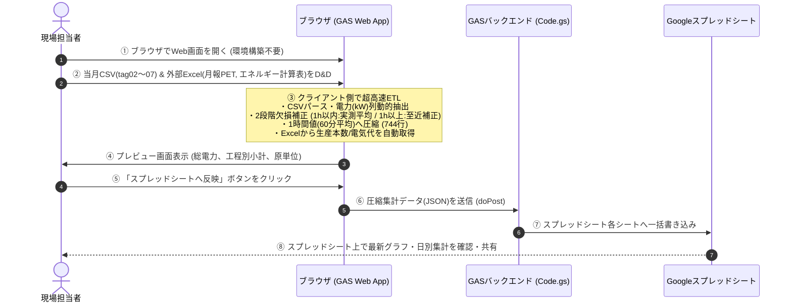

# 実装計画書（要件定義）
## プロジェクト名：エネルギー使用量集計システム

---

## 1. プロジェクト概要

### 1.1 背景と課題
- 工場の各機器・電源盤から、データロガーを通じて**1分間隔**で計測された電力データ（CSV/テキスト）が出力されている（月間で約44,640行/ファイル × 5ファイル）。
- 生データには電力（kW）以外に、電流（A）、電力量（kWh）、各種センサー値（温度、流量等）が混在している。
- 停電等によるデータ欠損が発生することがあり、欠損に対する段階的補正（1時間以内は実測平均、1時間以上は至近データ補間）が必要。
- 従来は巨大なExcelワークブック（約30MB〜60MB）のマクロや数式で手作業集計していたが、動作が極めて重くフリーズが多発し、属人化していた。

### 1.2 目的・ゴール
- **環境構築不要（ゼロインストール）**で、工場の誰でもブラウザから更新できるWebアプリケーション（GAS Web App + Googleスプレッドシート）を構築する。
- 1分間隔の生データファイル群（tag02, 04, 05, 06, 07）および外部データ（月報PET、かつらぎ工場エネルギー計算表）をドラッグ＆ドロップするだけで、数秒で前処理・集計（744行への圧縮）を実行し、スプレッドシートへ自動反映する。
- 日別・月別の電力使用量テーブルおよびグラフを可視化し、品種別生産本数・電気料金と連携した**電力原単位（kWh/本、円/本等）**を自動算出する。

---

## 2. システム構成と業務フロー

### 2.1 アーキテクチャ
- **フロントエンド（クライアント側ブラウザ）**:
  - HTML5, CSS3, Vanilla JavaScript（またはPapaParse, SheetJS, Chart.js利用）
  - クライアント端末のCPUを活用し、月間約4.5万行の生CSVデータをブラウザ内で2〜3秒でパース・1時間集計（約744行へ圧縮）。
  - GASサーバーの「6分実行制限」やメモリ上限を根本から回避。
- **バックエンド（Google Apps Script: GAS）**:
  - `gas_app/Code.gs`, `gas_app/Config.gs`
  - Web Appエンドポイント（`doGet`, `doPost`）を提供。
  - フロントから受信した圧縮済み集計データ（JSON: 約744行×70列）を受け取り、スプレッドシートへ `Range.setValues()` で一括書き込み（1〜2秒）。
- **データストレージ・可視化（Googleスプレッドシート）**:
  - 「1時間集計(ALL)」「日別集計」「月別集約」「KPI原単位」「品種」「ステップ」シート。
  - チーム全員がリアルタイムにブラウザ上でデータやグラフを閲覧・共有・エクスポート可能。

### 2.2 業務フロー

---

## 3. 入力データおよびマスター仕様

### 3.1 プロセスデータ（ロガー生データ）
| タグ種別 | ファイル命名規則 | 主要抽出項目 | 抽出・除外ルール |
|---|---|---|---|
| **tag02** | `*tag02.txt` | D99:品種、ステップ、運転フラグ、温度、流量 | 電力列はなし。工程・品種判定に使用 |
| **tag04** | `*tag04.txt` | No.1〜3コンプレッサー電力 (kW) | 単位行が `kW` の列のみ抽出（A, L, L/minは除外） |
| **tag05** | `*tag05.txt` | AMPAC、コンプレッサー盤、井水純水、排水処理等の電力 (kW) | 単位行が `kW` の列のみ抽出（A, kWh等は除外） |
| **tag06** | `*tag06.txt` | 屋上室外機、チラー、粕搬送、充填パネル等の電力 (kW) | 単位行が `kW` の列のみ抽出（A, kWh等は除外） |
| **tag07** | `*tag07.txt` | 抽出パネル、殺菌制御盤、調合タンク等の電力 (kW) | 単位行が `kW` の列のみ抽出（A, kWh等は除外） |

### 3.2 外部連携データ（燃料エネルギー集計用データ）
1. **`月報PET 2025年度～.xls`**:
   - シート名: `PET(2025)` 等（年度別シート）
   - 抽出項目: 対象年月の品種別生産本数（千本/月）、容器容量（L）、定格BPM
2. **`かつらぎ工場エネルギー計算表.xlsx`**:
   - シート名: `年度推移` または対象年シート（`2024` 等）
   - 抽出項目: 対象年月の使用電力量（千kWh）、電気料金請求額（千円）、電力量単価（円/kWh）

### 3.3 マスターデータ
- **品種マスター**: 100:停止, 101:2L長角, 102:1.5L長角, 103:1L長角, 104:900ml長角, 105〜110:各製品
- **ステップマスター**: 0:その他, 10:SIP, 20:水運転, 30:実充填, 40:CIP
- **機器・電源盤分類マスター**: 各測定列を用途グループ（総電力, チラー, 調合抽出, 供給, 充填, 包装, ユーティリティ）に分類

---

## 4. 計算ロジック・仕様詳細

### 4.1 1分値から1時間値への変換ロジック
- 毎時00分〜59分の60分間を1ブロックとする（1日24行、月間672〜744行）。
- **ロジック**:
  $$\text{1時間の消費電力量 (kWh)} = \text{ROUND}\left( \text{AVERAGE}(\text{有効な1分値電力 kW}), 1 \right)$$
- **欠損補正ルール**:
  - **1時間以内欠損（有効データ数が1件以上60件未満の場合）**:
    - 存在する実測データのみで平均を計算（例: 45件あればその45件の平均）。
  - **1時間以上欠損（該当1時間内のデータが0件の場合）**:
    - 直前の正常な1時間平均値（至近データ）で補間。補間フラグ（`isInterpolated=true`）を記録。

### 4.2 稼働時間および稼働モード集計
- 1時間ブロック内において、tag02のステップコードに基づき以下をカウント：
  - 水運転時間（分）: ステップ大分類 20 の分数を合算
  - 実充填時間（分）: ステップ大分類 30 の分数を合算
  - CIP時間（分）: ステップ大分類 40 の分数を合算
  - SIP時間（分）: ステップ大分類 10 の分数を合算
  - その他・停止時間（分）: ステップ大分類 0 の分数を合算

### 4.3 KPI・原単位算出ロジック
- **総電力量 (kWh)**: 各機器の月間合計電力量
- **操業時間 (分)**: 実充填時間合計、水運転時間合計
- **単位時間電力量 (kWh/分)**: 電力量 (kWh) ÷ 操業時間 (分)
- **単位本電力量（原単位）(kWh/本)**: 電力量 (kWh) ÷ 生産本数 (本)
- **単位本コスト (円/本)**: 原単位 (kWh/本) × 電力量単価 (円/kWh)
- **評価区分**: 「水運転＋実充填」「水運転のみ」「実充填のみ」の3パターンを分離集計

---

## 5. 機能一覧（Feature Checklist）

- [ ] **F-1: ファイル投入・解析**
  - [ ] ドラッグ＆ドロップ対応ファイルアップローダー（複数ファイル・フォルダ対応）
  - [ ] **複数月・年次一括投入対応（ファイル群の自動年月グループ化＆順次バッチ処理）**
  - [ ] tag02, 04, 05, 06, 07 の自動認識・ソート・結合
  - [ ] 外部Excel（月報PET, かつらぎ工場エネルギー計算表）の複数月・年次一括読み込み
  - [ ] 文字コード（Shift_JIS / UTF-8）自動判別
- [ ] **F-2: データ抽出・2段階欠損補正**
  - [ ] 電力（kW）列の動的特定・抽出
  - [ ] 1時間以内欠損の実測平均計算
  - [ ] 1時間以上欠損の至近データ補間
- [ ] **F-3: 集計エンジン**
  - [ ] 1行1時間テーブル生成（月あたり約744行、年間約8,760行、小数第1位丸め）
  - [ ] 機器・電源盤グループ別小計（チラー、調合抽出、供給、充填、包装、総電力）
  - [ ] 稼働モード（水運転/実充填等）時間カウント
  - [ ] 日別合計・月別合計集約・年次累積集約
  - [ ] 原単位（kWh/本、円/本等）の自動算出
- [ ] **F-4: UI・プレビュー・可視化**
  - [ ] 取り込みステータス・進捗プログレスバー（「○月度処理中 (X/Y)」等のリアルタイム表示）
  - [ ] 日別消費量・工程別内訳テーブル表示
  - [ ] 月次推移・年次推移・原単位グラフ表示（Chart.js）
- [ ] **F-5: スプレッドシート連携・出力**
  - [ ] **Upsert（日時キーによる既存データ上書き・差分追加）対応のGAS API**
  - [ ] 年度別シート分割または累積時系列テーブル管理
  - [ ] 原紙フォーマット互換Excelエクスポート機能
  - [ ] **大量データ一括投入用ローカルバッチスクリプト（Pythonツール併備）**

---

## 6. 非機能要件
- **動作環境**: 特別なソフトのインストール不要。Google Chrome, Edge等のモダンブラウザ。
- **処理速度・スケーラビリティ**:
  - 単月（4.5万行）: ブラウザ集計 **5秒以内**、スプレッドシート反映 **3秒以内**。
  - 年間一括（約50万行）: 順次バッチ処理によりブラウザがクラッシュすることなく **1分以内** に完了。
- **データ容量・スプレッドシート制限対策**:
  - 1時間集約後のデータ（年間8,760行 × 70列 ＝ 約61万セル）を扱うため、Googleスプレッドシートの上限（1,000万セル）に対し数年分（約10年分）を蓄積可能。
- **堅牢性**: 停電等の欠損データがあってもエラーにならず、至近補正フラグ付きで正常完了すること。

